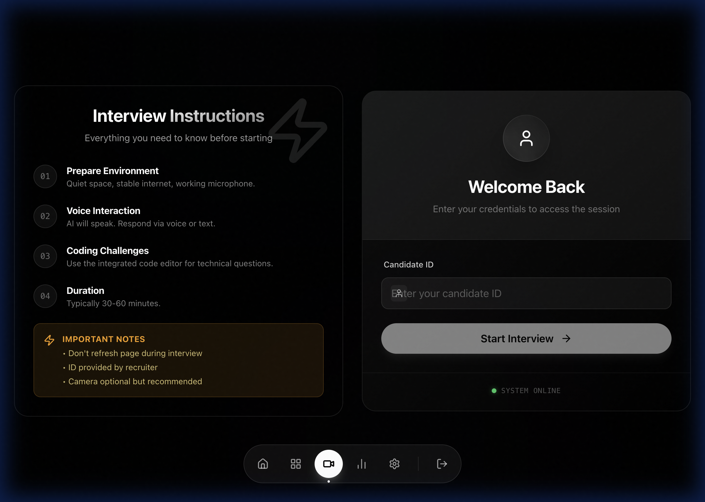

<div align="center">
  

  <h1 align="center">AI Technical Interviewer</h1>

  <p align="center">
    <strong>The Next Generation of Technical Hiring</strong>
    <br />
    An AI-powered platform that conducts real-time video interviews, analyzes code context, and provides deep performance insights using GPT-4.
    <br />
    <br />
    <a href="#demo">View Demo</a>
    ·
    <a href="https://github.com/QuantumBreakz/Master-the-Interview/issues">Report Bug</a>
    ·
    <a href="https://github.com/QuantumBreakz/Master-the-Interview/issues">Request Feature</a>
  </p>
</div>

<div align="center">


</div>

<br />

## 📸 Screenshots

### **1. Modern Landing Page**
*A clean, high-conversion landing page designed to attract top engineering talent.*


### **2. Immersive Dashboard**
*Track your progress, view recent session scores, and start new interviews with a premium, Bento-grid inspired interface.*


### **3. Intelligent Interview Room**
*Real-time video interaction, live coding environment, and AI-driven conversation.*


---

## 📖 Table of Contents

- [About The Project](#-about-the-project)
- [Key Features](#-key-features)
- [Architecture](#-architecture)
- [Getting Started](#-getting-started)
  - [Prerequisites](#prerequisites)
  - [Installation](#installation)
- [Running the Codebase](#-running-the-codebase)
- [Environment Variables](#-environment-variables)
- [Project Structure](#-project-structure)
- [Contributing](#-contributing)
- [License](#-license)
- [Contact](#-contact)

---

## 💡 About The Project

**AI Technical Interviewer** redefines the technical hiring process. It replaces the first round of technical screening with an intelligent, unbiased, and tireless AI agent. 

Unlike standard coding tests, this platform conducts a **conversational interview**. It asks follow-up questions, challenges assumptions, and evaluates the candidate's communication skills alongside their raw technical ability.

**Why use this?**
*   **For Recruiters:** Save hundreds of hours on screening calls. Get a detailed breakdown of a candidate's strengths before you even meet them.
*   **For Candidates:** Practice technical interviews in a low-stress environment with instant feedback to improve your skills.

---

## ✨ Key Features

- **🤖 Autonomous AI Interviewer**: Uses GPT-4 to generate context-aware questions based on the candidate's resume and live responses.
- **💻 Live Coding Environment**: Integrated code editor that supports multiple languages, with the AI able to read and critique the code in real-time.
- **🎨 Premium "Apple-Style" UI**: A visually stunning interface built with Tailwind CSS, featuring glassmorphism, dark mode, and fluid animations.
- **📊 Deep Analytics**: Generates a comprehensive PDF report analyzing:
    - **Technical Accuracy** (Correctness of solutions)
    - **Communication** (Clarity and articulation)
    - **Problem Solving** (Approach and methodology)
- **⚡ Real-Time Feedback**: Low-latency voice interaction using advanced speech-to-text and text-to-speech pipelines.

---

## 🏗 Architecture

The platform is engineered as a distributed system to ensure scalability and performance.

### **1. Frontend (The Experience)**
Built with **React 18** and **Vite**, the frontend delivers a native-app feel.
*   **State Management**: React Hooks & Context API.
*   **Styling**: Tailwind CSS with a custom "True Black" design system.
*   **Motion**: Framer Motion for smooth page transitions and micro-interactions.

### **2. Backend (The Orchestrator)**
A robust **Node.js/Express** server that acts as the central hub.
*   **Database**: MongoDB (via Mongoose) for storing user profiles, session logs, and analysis reports.
*   **API**: RESTful endpoints for frontend communication.
*   **Security**: JWT-based authentication and secure session management.

### **3. AI Analysis Service (The Brain)**
A specialized **Python/Flask** microservice dedicated to ML tasks.
*   **LLM Integration**: Direct interface with OpenAI's API for prompt engineering and response generation.
*   **Analytics**: Scikit-learn and Pandas for calculating performance metrics and generating data visualizations.

---

## 🚀 Getting Started

Follow these steps to set up the project locally.

### Prerequisites

*   **Node.js** (v16+)
*   **Python** (v3.8+)
*   **MongoDB** (Local or Atlas)
*   **OpenAI API Key**

### Installation

1.  **Clone the Repository**
    ```bash
    git clone https://github.com/QuantumBreakz/Master-the-Interview.git
    cd Master-the-Interview
    ```

2.  **Install Backend Dependencies**
    ```bash
    cd backend
    npm install
    cp .env.example .env
    # Edit .env with your API keys
    ```

3.  **Install AI Service Dependencies**
    ```bash
    cd ../ai-analysis
    python -m venv venv
    source venv/bin/activate  # Windows: venv\Scripts\activate
    pip install -r requirements.txt
    cp .env.example .env
    ```

4.  **Install Frontend Dependencies**
    ```bash
    cd ../frontend
    npm install
    cp .env.example .env
    ```

---

## 🏃‍♂️ Running the Codebase

To run the entire system, you will need to start all three services. Open **3 separate terminal windows**:

**Terminal 1 (Backend)**
```bash
cd backend
npm start
```

**Terminal 2 (AI Service)**
```bash
cd ai-analysis
source venv/bin/activate
python api.py
```

**Terminal 3 (Frontend)**
```bash
cd frontend
npm run dev
```

🚀 Open your browser to **http://localhost:5173** to start!

---

## 🔑 Environment Variables

### Backend (`backend/.env`)
| Variable | Description |
|----------|-------------|
| `PORT` | 3000 |
| `MONGO_URI` | MongoDB Connection String |
| `OPENAI_API_KEY` | OpenAI API Key |
| `AI_ANALYSIS_URL` | http://localhost:5001 |
| `FRONTEND_URL` | http://localhost:5173 |

### AI Service (`ai-analysis/.env`)
| Variable | Description |
|----------|-------------|
| `PORT` | 5001 |
| `OPENAI_API_KEY` | OpenAI API Key |

### Frontend (`frontend/.env`)
| Variable | Description |
|----------|-------------|
| `VITE_AI_BACKEND_URL` | http://localhost:3000 |

---

## 📂 Project Structure

```bash
/
├── frontend/             # React Application
│   ├── public/           # Static assets (images, icons)
│   ├── src/
│   │   ├── components/   # Reusable UI (Bento cards, Glass panels)
│   │   ├── pages/        # Dashboard, Interview, Results
│   │   └── ...
├── backend/              # Node.js API Server
│   ├── models/           # Database Schemas
│   ├── routes/           # API Endpoints
│   └── ...
├── ai-analysis/          # Python AI Microservice
│   ├── api.py            # Flask App Entry Point
│   ├── data/             # Training/Context data
│   └── ...
└── README.md             # Documentation
```

---

## 🤝 Contributing

We welcome contributions! Please see `CONTRIBUTING.md` for details on how to submit pull requests, report issues, and suggest improvements.

---

## 📄 License

Distributed under the MIT License. See `LICENSE` for more information.

---

## 📧 Contact

Project Link: [https://github.com/QuantumBreakz/Master-the-Interview](https://github.com/QuantumBreakz/Master-the-Interview)
